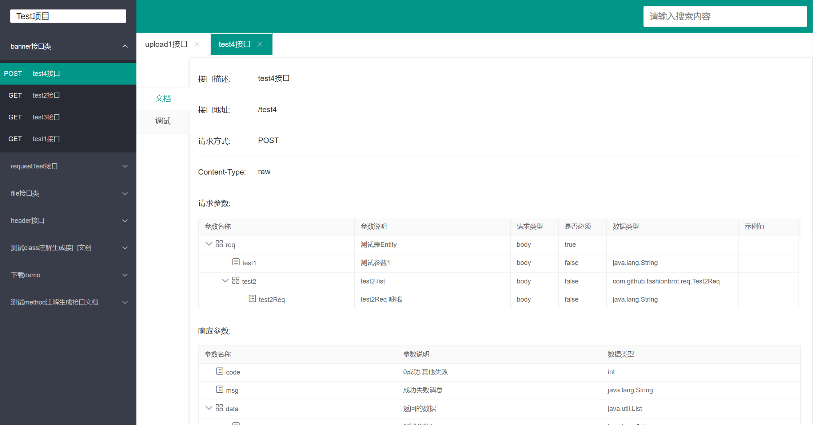
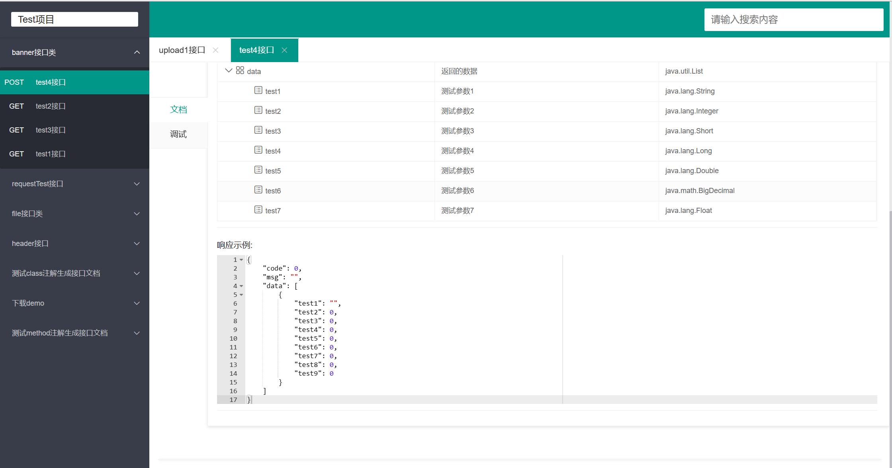
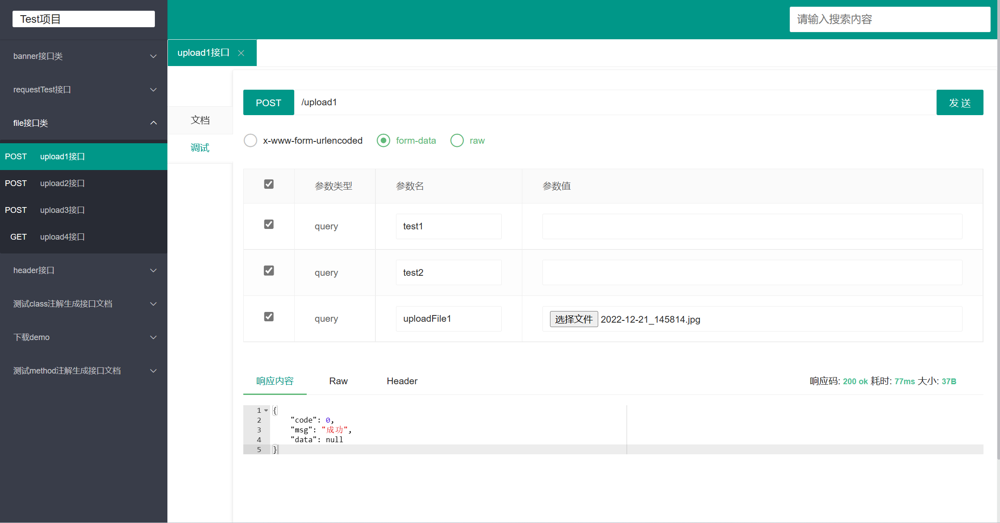

## mars-doc 接口文档生成工具

##### 目前支持spring接口、springboot 接口，其他接口待支持

##### github:https://github.com/fashionbrot/mars-doc.git
##### gitee :https://gitee.com/fashionbrot/mars-doc.git


| 版本 | 版本说明|     
|---|--------|
|0.0.1| 基础功能上线|


#### 使用环境

##### spring4.0 及以上
##### jdk1.8 


#### 注解说明
| 注解            | 范围                            | 说明                    | 示例                                       |
|---------------|-------------------------------|-----------------------|------------------------------------------|
| @ApiIgnore    | Class Method Parameter  Field | 使用该注解忽略               | @ApiIgnore|
| @Api          | Class                         | 修饰整个类，描述Controller的作用 | @Api(value = "banner接口类",priority = 99)  |
| @ApiOperation | Method                        | 描述一个类的一个方法            |     @ApiOperation(value = "test4接口",priority = 1000)  |
|@ApiModel | Class                         | class对象说明             |@ApiModel("RespVo统一返回类型")|
|@ApiModelProperty |   Parameter   Field | Class属性描述             |    @ApiModelProperty("返回的数据")|
|@ApiImplicitParam | Method | 接口参数注解 |    @ApiImplicitParam(name ="uploadFile1",value = "文件",paramType = "query",dataType = "file",multiple = "multiple")|

#### 访问地址: http://ip:port/doc.html

#### springboot 接入说明
##### 引入jar文件
```gradle
    implementation "com.github.fashionbrot:spring-boot-starter-doc:0.0.1"
```
```xml
     <dependency>
        <groupId>com.github.fashionbrot</groupId>
        <artifactId>spring-boot-starter-doc</artifactId>
        <version>0.0.1</version>
    </dependency>
```
#### application.properties 配置
```properties
# 项目名 默认：default
mars.doc.group-name=Test项目
# 项目描述
mars.doc.description=测试注释
# 项目访问地址 默认：http://ip:port
mars.doc.base-url =http://localhost:9090/
# 要显示文档的环境(多个逗号分割) 默认：default
mars.doc.spring-profiles-active=test,dev,local
# 要扫描的接口地址(多个逗号分割)
mars.doc.scan-base-package=com.github.fashionbrot.controller.**,com.github.fashionbrot.testController

# 访问接口文档的账号(不填写不需要登录)
mars.doc.username = test
# 访问接口文档的密码(不填写不需要登录)
mars.doc.password=test

# 通过此注解添加到Class上开启文档 (自定义注解)
mars.doc.with-class-annotation=com.github.fashionbrot.annotation.ApiClassAnnotation
# 通过次注解添加到Method 上开启文档 (自定义注解)
mars.doc.with-method-annotation=com.github.fashionbrot.annotation.ApiMethodAnnotation
```

##### Entity 配置

```java
@Data
@Builder
@AllArgsConstructor
@NoArgsConstructor
@ApiModel("RespVo统一返回类型")
public class RespVo<T> implements Serializable {
    private static final long serialVersionUID = -3655390020082644681L;

    public static final int SUCCESS = RespEnum.SUCCESS.getCode();
    public static final int FAILED = RespEnum.FAIL.getCode();
    public static final RespVo vo = RespVo.success(null);

    @ApiModelProperty("0成功,其他失败")
    private int code;
    @ApiModelProperty("成功失败消息")
    private String msg;
    @ApiModelProperty("返回的数据")
    private T data;
    
}
```

##### 接口配置
```java
import com.github.fashionbrot.doc.RespVo;
import com.github.fashionbrot.doc.annotation.Api;
import com.github.fashionbrot.doc.annotation.ApiIgnore;
import com.github.fashionbrot.doc.annotation.ApiImplicitParam;
import com.github.fashionbrot.doc.annotation.ApiOperation;
import com.github.fashionbrot.req.RequestReq2;
import com.github.fashionbrot.req.Upload2Req;
import org.springframework.stereotype.Controller;
import org.springframework.web.bind.annotation.*;
import org.springframework.web.multipart.MultipartFile;

import java.util.List;

@Api(value = "file接口类",priority = 90)
@Controller
public class FileController {

    @ApiImplicitParam(name ="uploadFile1",value = "文件",paramType = "query",dataType = "file",multiple = "multiple")
    @ApiOperation(value = "upload1接口",priority = 70)
    @PostMapping("upload1")
    @ResponseBody
    private RespVo upload1(@ApiIgnore @RequestPart("uploadFile1") List<MultipartFile> multipartFile, String test1, String test2){
        return RespVo.success();
    }

    @ApiImplicitParam(name ="uploadFile2",value = "文件",paramType = "query",dataType = "file",multiple = "multiple")
    @ApiOperation(value = "upload2接口",priority = 60)
    @PostMapping("upload2")
    @ResponseBody
    private RespVo upload2(@ApiIgnore @RequestParam("uploadFile2") MultipartFile[] multipartFile, Upload2Req req){
        return RespVo.success();
    }

    @ApiOperation(value = "upload3接口",priority = 50)
    @ResponseBody
    @PostMapping("upload3")
    public RespVo<Integer> upload3(@RequestBody RequestReq2 requestReq1){

        return RespVo.success(1);
    }

    @ApiOperation(value = "upload4接口",priority = 40)
    @ResponseBody
    @GetMapping("upload4")
    public RespVo<Integer> upload4( Upload2Req requestReq1){

        return RespVo.success(1);
    }

}
```





